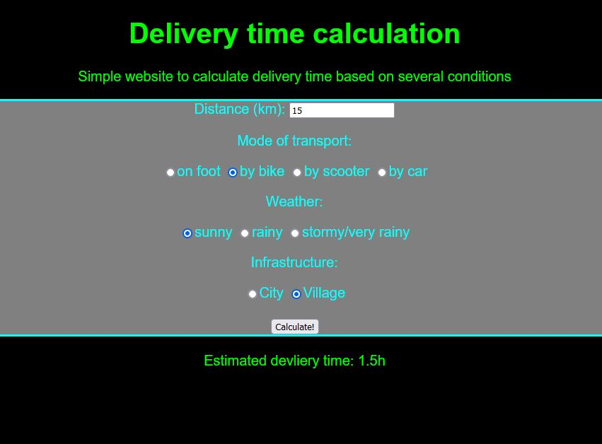

# Delivery time calculator
#### Languages used:
HTML, CSS, JavaScript, jQuerry

#### Description:
Delivery time calculator is a simple calculator that calculates the expected delivery time based on several user-selectable variables.

#### How it works:
User must enter the distance (in kilometres), then select:
- mode of transport: on foot (4km/h), by bicycle (10km/h), by scooter (40km/h), by car (90km/h)
- weather: sunny (delivery time unchanged), rainy (delivery time multiplied by 1.2), stormy/very rainy (delivery time multiplied by 1.4)
- infrastructure: city (delivery time multiplied by 1.25), countryside (delivery time unchanged)

#### Example
